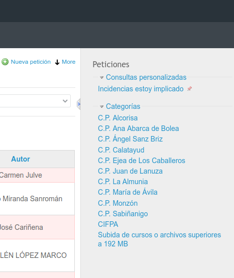

## Soporte

### 4\. Para consultar el listado de peticiones

Para consultar las peticiones recibidas desplegaremos la opción _**Incidencias**_ y haremos click en _**Peticiones**_.

  

  

  

Desde aquí podremos consultar el **listado de todas las peticiones** recibidas en el proyecto Aeducar desde todo Aragón. Esta opción de compartir toda la información permite que aprendamos de las experiencias de otros centros y así poder ir aumentando nuestra autonomía en la gestión de nuestro centro.

Nos fijamos en la página del listado de peticiones y vemos que en primer lugar tenemos una sección desde donde podemos aplicar distintos **filtros**. Ésto va a ser de gran utilidad si el número de peticiones es elevado y queremos ver sólo aquellas que cumplen determinadas condiciones.

Como vemos en la imagen siguiente, el listado muestra las peticiones que se encuentran en **Estado** **_abierta_**, pero en el desplegable de la derecha podríamos elegir otras condiciones de selección, como palabras que queremos que aparezcan en el **Asunto** o **Descripción**, para localizar peticiones sobre determinados temas.  

Para acceder a la ficha completa de la petición simplemente haremos click en el asunto de la misma y nos abrirá la página con la información completa.
  

El menú derecho (que podemos encontar escondido), nos facilita un listado de consultas personalizadas. Éstas puede ser por categorías, Generales o incluso las que creemos y nos guaerdemos nosotros mismos.
También es viable reordenarlas por importancia con la chincheta.

