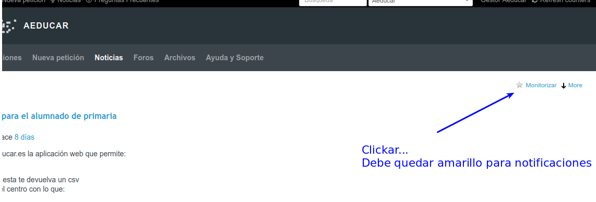

## Soporte

### 6\. Otras funcionalidades

Además de la gestión propia de incidencias, esta plataforma también integra las siguientes secciones que redundan en un mejor servicio e intercambio de informaciones sobre el proyecto Aeducar.

*   **Noticias**: Las noticias sobre éste proyecto u otros irán apareciendo en éste apartado. Cada proyecto tiene una sección de noticias y en la página principal podemos ver todas.

Es muy importante (si queremos estar informados por correo) monitorizar las noticias. Para ello deberá estar activa la estrella de monitorización.

*   **Foro**: Existe un foro donde compartir las dudas no específicas o temas generales que vayan surgiendo. Sobre todo pensando en que es abierto a toda la comunidad...no es una incidencia...son preguntas "generales".
    

*   **Respuestas predefinidas**: Permite ir recopilando las respuestas más habituales a determinadas peticiones y así reutilizarlas para agilizar la tarea de soporte desde la edición de la ficha. La redacción de las mismas puede ser realizada únicamente desde el perfil de las asesorías de referencia de cada Centro de Profesorado. Muy útil para el asesor.
    

*   **Ayuda y Soporte**: Para ir recopilando las preguntas frecuentes (FAQ) sobre el uso de la plataforma. La redacción de las mismas puede ser realizada únicamente desde el perfil de las asesorías de referencia de cada Centro de Profesorado, aunque el gestor de centro puede contribuir con respuestas alternativas.
    

